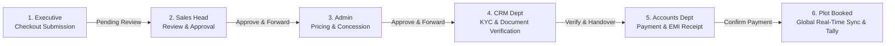

# TERRA 2.0 (ARK) — Progress & Resume Memory File (`1ark.md`)

> **Date Logged:** August 14, 2026  
> **Project:** ARK / Terra Site Manager 2.0  
> **Status:** All requested features & workflow pipelines implemented and verified. Dev server running smoothly.

---

## 📌 Executive Overview & Architecture State

Today we built, refined, and integrated major enterprise workflows, terminology updates, and role-based department security in **TERRA 2.0**.

### Core Architecture & Tech Stack:
- **Frontend:** React + Vite + TypeScript + TanStack Router & Query + Tailwind CSS.
- **Visuals:** Three.js Liquid Animation with custom `TERRA 2.0` graphics canvas (`/terra-bg.png`).
- **Database:** Supabase PostgreSQL with custom RLS policies, RPC helper functions, and user role hierarchy.
- **Accounting:** Tally Prime double-entry Journal Voucher sync (`port 9000`).

---

## 🛠️ Work Accomplished Today (Summary of Changes)

### 1. Database & Cloned Data Restoration
- Restored **5 projects** and **40 mapped plot parcels** with exact boundary coordinates from SQL dump.
- Added automatic fallback to old Supabase public storage bucket (`zolbuckwnjsxfgqqkcjj`) for historical cover & layout images.

### 2. Terminology & Role Renaming Across UI
- **`employee` / `employees` $\rightarrow$ `Executive` / `Executives`**: Updated across form dialogs, user tables, role badges, CRM dashboards, and installment view-only banners.
- **`manager` / `managers` $\rightarrow$ `Sales Head` / `Sales Heads`**: Updated across form selects, table headers (`SALES HEADS`), hierarchy sorting, reporting lines, and dashboard cards.

### 3. Accounts Manager Role (`accounts`)
- Granted `accounts` role full administrative financial power across **Treasury**, **Bookings**, **Installments**, **Incentives**, **Projects**, **Analytics**, and **Documents**.

### 4. CRM Department Role (`crm`)
- Added `'crm'` to Supabase `app_role` enum and types.
- Granted `crm` team full oversight for lead management, website contact inquiries, customer KYC verification, and agreement processing.

### 5. Multi-Department Sequential Booking Approval Workflow
Implemented the complete 5-stage sequential plot booking approval engine requested by the client:

- **Dedicated Approvals Hub (`/approvals`)**: Created a new workspace featuring:
  - **Interactive 5-Stage Stepper Bar**: Displays live pipeline progress on every deal card.
  - **Role Queue Filtering**: Shows deals waiting specifically for the logged-in user's role (`Sales Head`, `Admin`, `CRM`, `Accounts`).
  - **Stage Action Modals**:
    - *Sales Head Modal:* Review deal & executive incentive $\rightarrow$ Click **"Approve & Send to Admin"**.
    - *Admin Modal:* Review price concession & plot allocation $\rightarrow$ Click **"Approve & Send to CRM"**.
    - *CRM Modal:* Verify customer Aadhaar, PAN, & address $\rightarrow$ Click **"Verify & Send to Accounts"**.
    - *Accounts Modal:* Record payment method, transaction ref/UTR, & advance amount $\rightarrow$ Click **"Confirm Payment & Finalize Booking"**.
- **Live Sidebar Badges (`/route.tsx`)**: Added red pending count badges next to the **Approvals** sidebar item.
- **Global Realization:** Upon Accounts payment confirmation, plot status automatically updates to `booked`/`sold` globally across Site Mapper, Dashboard, Projects, and Tally Prime.

---

## 📁 Key Files Created / Modified Today

| File Path | Description |
| :--- | :--- |
| [`src/routes/_authenticated/approvals.tsx`](file:///g:/projects/ARK/ARK/src/routes/_authenticated/approvals.tsx) | **[NEW]** Approvals Workspace with pipeline steppers, role queues, and department action modals |
| [`supabase/migrations/20260814000000_add_accounts_app_role.sql`](file:///g:/projects/ARK/ARK/supabase/migrations/20260814000000_add_accounts_app_role.sql) | Migration adding `accounts` app_role and RPC helpers |
| [`supabase/migrations/20260814010000_add_crm_app_role.sql`](file:///g:/projects/ARK/ARK/supabase/migrations/20260814010000_add_crm_app_role.sql) | Migration adding `crm` app_role and RPC helpers |
| [`supabase/migrations/20260814020000_sequential_booking_approval_flow.sql`](file:///g:/projects/ARK/ARK/supabase/migrations/20260814020000_sequential_booking_approval_flow.sql) | Migration adding `approval_stage` and `approval_history` audit columns |
| [`src/routes/_authenticated/plots.$plotId.book.checkout.tsx`](file:///g:/projects/ARK/ARK/src/routes/_authenticated/plots.$plotId.book.checkout.tsx) | Routes new bookings to `sales_head_approval` stage and notifies Sales Head |
| [`src/routes/_authenticated/route.tsx`](file:///g:/projects/ARK/ARK/src/routes/_authenticated/route.tsx) | Added **Approvals** nav item with live pending count badges |
| [`src/routes/_authenticated/bookings.tsx`](file:///g:/projects/ARK/ARK/src/routes/_authenticated/bookings.tsx) | Added **Approvals Center** header button and stage indicators |
| [`src/components/team/EmployeeFormDialog.tsx`](file:///g:/projects/ARK/ARK/src/components/team/EmployeeFormDialog.tsx) | Updated role select options to Executive, Sales Head, CRM Executive, Accounts Manager |
| [`src/components/team/TeamTable.tsx`](file:///g:/projects/ARK/ARK/src/components/team/TeamTable.tsx) | Updated hierarchy, group names (`SALES HEADS`, `CRM TEAM`, `EXECUTIVES`), and role badges |
| [`src/integrations/supabase/types.ts`](file:///g:/projects/ARK/ARK/src/integrations/supabase/types.ts) | Updated Supabase TypeScript definitions for roles and booking approval columns |

---

## 🎯 Pick-Up Point For Tomorrow

When starting work tomorrow:

1. **Database Migration Execution (if connecting to remote Supabase):**
   Run the 3 new SQL migration files in the Supabase SQL Editor:
   - `supabase/migrations/20260814000000_add_accounts_app_role.sql`
   - `supabase/migrations/20260814010000_add_crm_app_role.sql`
   - `supabase/migrations/20260814020000_sequential_booking_approval_flow.sql`

2. **Role Approval Flow Testing:**
   Test creating a booking as an Executive, approving it as a Sales Head, forwarding it as an Admin, verifying KYC as CRM, and completing payment as Accounts.

3. **Client Flow Customizations:**
   Check with the user/client for any additional CRM or Accounts custom forms/fields to add to the approval modals.
